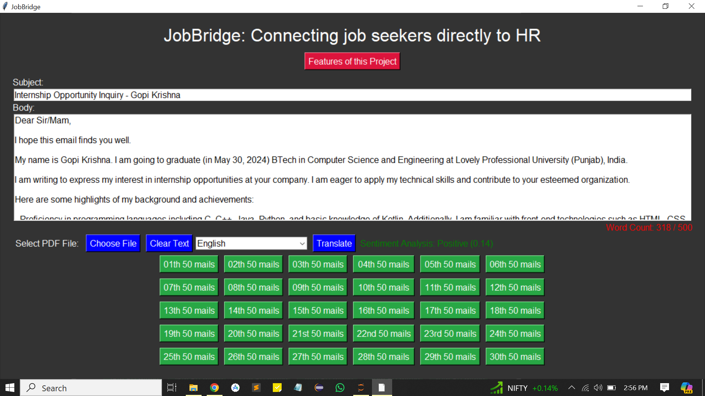
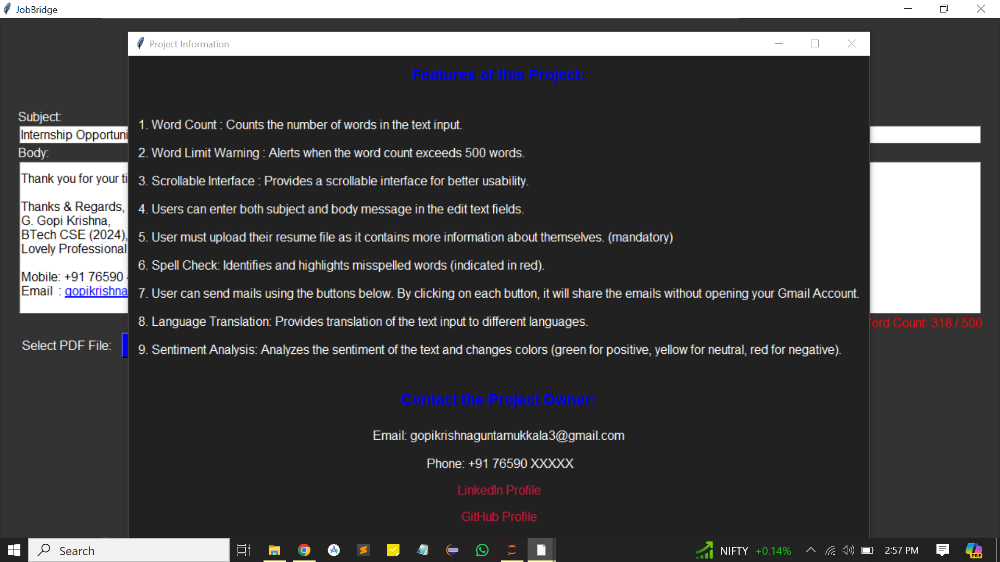

# JobBridge
Connecting job seekers directly to HR Mails (Connecting job seekers directly to HR Mail for an enquiry of internships or full time jobs)

# 🚀 Introducing JobBridge: Connecting Job Seekers Directly to HR Mails! 🚀

I'm excited to share JobBridge, a powerful tool designed to help job seekers send emails to HR mails effortlessly and efficiently, all without opening Gmail! 📧✨

## 📧 Purpose :
Every month, there are numerous openings in various companies. Job seekers may find it challenging to send individual emails to each company. JobBridge allows users to share their resume and job role information with HR mails whenever they want, saving time and offering the advantage of privately sharing their applications for internships or full-time jobs. This tool not only streamlines the application process but also provides significant time-saving advantages.

## 📧 Additional Advantages :

**Efficiency**: JobBridge enables users to apply to multiple job openings swiftly, eliminating the need for repetitive manual processes.

**Customization**: Users can personalize each application with tailored subject lines and messages, enhancing their chances of standing out to recruiters.

**Privacy**: By privately sharing applications with HR mails, users maintain confidentiality and control over their job search process.

## Project Images :

## 🌟 Key Features :

- **✍️ Word Count**: Counts the number of words in your message.
- **🚨 Word Limit Warning**: Alerts you when your message exceeds 500 words.
- **📜 Scrollable Interface**: Enhances usability with a scrollable text area.
- **📝 Subject and Body Fields**: Enter both subject and body of the email seamlessly.
- **📎 Resume Upload**: Mandatory resume upload for comprehensive job applications.
- **🔴 Spell Check**: Highlights misspelled words in red.
- **🚀 Direct Email Sending**: Send emails directly with a click, without opening Gmail.
- **🌐 Language Translation**: Translate your message into different languages.
- **💬 Sentiment Analysis**: Analyzes and color-codes your message sentiment (green for positive, yellow for neutral, red for negative).

## 🛠️ Tech Stack Used:
- Python
- Tkinter for GUI
- Various other libraries for enhanced functionality

## Usage

1. Use the GUI to fill in the email subject and body, upload your resume, and send your application directly to HR emails.

## **Feel free to reach out if you have any questions or suggestions! Happy job hunting with JobBridge!** 🚀
